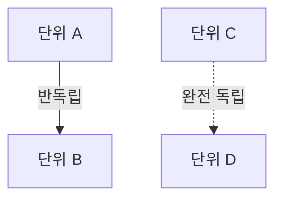

# Phase 2 + 2.5: 구현 전략 수립 + Red Team 코드 공격

> ⚠️ VERIFY: Critical/High RT 항목이 모두 해결된 후에만 Phase 3 진입.

---

## Phase 2: 플랜의 플랜 (구현 전략 수립)

1. **리드**: Phase 1 종합 결과 + **충돌/모순 해소 결과** 기반으로 구현 전략 초안 작성 (DEFERRED 항목은 전략에 분기점으로 명시)
2. **분석가들 (병렬)**: 각자 담당 페이지 범위의 수정 대상 파일 구체화 + 변경 복잡도 추정
3. **리드**: 분석가 결과 통합 → 의존성 그래프 작성 + 순환 의존 탐지
4. **리드**: 구현 단위 분해 → Phase 4 Builder 배분 결정 (분석가 = Builder로 전환)
5. **리드**: 최악 시나리오 질문 루프 수행 + 노션 기입

### 6단계: 구현 범위 및 전략 도출

```
## 플랜의 플랜

### 전체 구현 범위
- [기획에서 요구하는 전체 기능/시스템 목록]

### 구현 단위 분해
1. [단위 1]: [설명] - 우선순위: [높음/중간/낮음]
2. [단위 2]: [설명] - 우선순위: [높음/중간/낮음]

### 의존성 그래프 + 의존성 유형 분류


### 구현 순서 (의존성 기반)
```mermaid
graph LR
    subgraph 1차 - 완전 독립, 동시 구현
        U1[단위 A → Builder A]
        U2[단위 C → Builder B]
    end
    subgraph 2차 - 반독립, A 완료 후
        U3[단위 B]
    end
    U1 --> U3
```

### 충돌/모순 해소 반영
- [C-01] 해소: [문서A 우선] → [전략에 미치는 영향]
- [I-01] 해소: [기획대로 변경] → [수정 범위 + 연쇄 영향]
- [DEFERRED 항목]: [분기점으로 처리, Phase 4에서 재확인]

### 기존 코드베이스 영향 분석
### 리스크 및 대안
```

### 7단계: 플랜의 플랜 — 최악 시나리오 검증 및 승인

사용자가 **"통과"를 선택할 때까지 반복**합니다.

### Phase 2 완료 → 노션 기입

---

## Phase 2.5: Red Team 코드 공격

> **목적**: Phase 2의 구현 전략을 **실제 코드베이스에 대조**하여 적대적으로 검증한다.

### 확신도 기반 실행 분기

| 조건 | Red Team 범위 | 이유 |
|------|--------------|------|
| 구현 단위 ≤ 1 AND 기존 코드 수정 ≤ 2파일 | **Phase 2.5 스킵** | 단순 변경 |
| 구현 단위 2~3 | **경량 Red Team** (RT-API + RT-STATE만) | 핵심 위험만 |
| 구현 단위 > 3 또는 새 시스템 도입 | **전체 Red Team** (6개 카테고리) | 전면 검증 |

### 팀 역할 분배

1. **분석가들 (병렬)**: 각자 담당 페이지 범위의 파일/클래스/메서드를 탐색하여 **코드 증거** 수집
2. **리드**: 분석가들의 증거를 종합하여 **공격 보고서** 작성 (심각도 + 대안 A/B)
3. **리드**: 공격 보고서의 각 항목에 대해 **AskUserQuestion 루프** 수행
4. **결과 저장**: `_devnotion_phase25_redteam.md`

### 공격 카테고리

| 카테고리 | 코드 | 검증 대상 | 탐색 방법 |
|----------|------|----------|----------|
| API 불일치 | **RT-API** | 메서드 시그니처, 접근제한자, 반환형 | Grep → Read 시그니처 확인 |
| 상태/초기화 | **RT-STATE** | null 가능성, Addressable 로드 타이밍 | 초기화 흐름 추적 |
| 훅/확장점 부재 | **RT-HOOK** | 이벤트, 콜백, 확장 포인트 존재 여부 | Grep 이벤트/delegate |
| 데이터 스키마 | **RT-DATA** | D_ 클래스, XML 필드, PlayerData 충돌 | XML + D_ 클래스 대조 |
| 타이밍/순서 | **RT-TIMING** | MonoBehaviour 실행 순서, async 타이밍 | ExecutionOrder, Awake/Start 분석 |
| 연쇄 수정 | **RT-CASCADE** | 단일 변경이 촉발하는 연쇄 수정 범위 | Grep 참조 검색 → 영향 범위 |

### 심각도 분류

| 심각도 | 기준 |
|--------|------|
| **Critical** | 구현 불가 — API 부재, 접근 불가, 핵심 훅 없음 |
| **High** | 런타임 에러 위험 — null, 타이밍, 데이터 손상 |
| **Medium** | 예상보다 복잡 — 연쇄 수정, 스코프 증가 |
| **Low** | 마이너 이슈 — 네이밍 충돌, 사소한 리팩토링 |

### AskUserQuestion 루프

```
반복 (공격 보고서의 각 항목):
  options:
    - "수용 - 대안 A" → 플랜에 반영
    - "수용 - 대안 B" → 플랜에 반영
    - "반박" → DISMISSED 처리
    - "통과 (위험 감수)" → ACCEPTED_RISK, Phase 3 주의사항으로 명시
```

### Phase 2.5 완료 → 노션 기입
