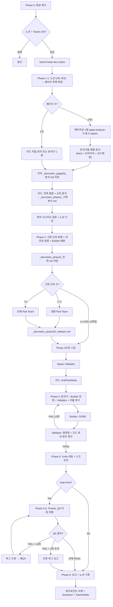

# Phase 5 + 5.5 + 6: Unity 세팅, QA 자동 순환, 완료 보고

---

## Phase 5: Unity 세팅 및 검증

0. **Unity CLI 연결 재확인**: `node .mcp-server/unity-cli.mjs get_state` 실행
   - 성공 → 1번으로 진행
   - 실패 → `/reconnect_unity_cli` 안내. 재연결 후 재시도. 재연결 불가 시 사용자에게 "Unity 세팅 수동 필요" 보고 후 Phase 6으로 스킵
1. **Builder들 (분석가 전환)**: Unity CLI로 씬/프리팹 세팅 (**순차 실행** — Unity WebSocket 동시 접근 불가)
2. **Validator**: 스크린샷 확인 + Phase 1에서 다운로드한 노션 디자인 이미지와 비교
3. **리드**: 노션 기입

Unity CLI 도구:
```bash
node .mcp-server/unity-cli.mjs [도구명] '[JSON params]'
```
- 씬 열기, 오브젝트 확인, 스크린샷, 씬 저장 모두 CLI로 수행

**씬/프리팹 변경 후에는 반드시 스크린샷을 찍어 확인하세요.**

### UI 오브젝트 생성 원칙
- UI(Canvas, Panel, Button 등)는 **코드 동적 생성(new GameObject + AddComponent) 금지**
- **프리팹으로 미리 만들어두고** Instantiate 또는 SetActive로 제어할 것
- 코드에서는 프리팹 참조 + 활성화/비활성화만 담당

### Phase 5 완료 → 노션 기입

---

## Phase 5.5: 구현-QA 자동 순환 (loop=true일 때만)

> `loop=true` 인자가 없으면 이 Phase를 스킵하고 Phase 6으로 진행한다.

Phase 5 완료 후, 구현된 기능을 `/Frame_QA`로 자동 검증하고, 발견된 버그를 수정하는 순환을 반복한다.

```
순환 (최대 3회):
  1. /Frame_QA 호출 — 구현된 기능에 대해 Play Mode QA 수행
     - Frame_QA가 생성한 버그 리포트를 수집

  2. QA 결과 판정:
     - 전체 PASS → 순환 종료, Phase 6으로 진행
     - FAIL 항목 존재 → 3단계로

  3. 버그 자동 수정:
     - 각 FAIL 항목에 대해 Builder가 코드 수정
     - Validator가 컴파일 + 코드 파괴 방지 체크 수행
     - 수정 내용을 _devnotion_phase55_qa_loop.md에 기록:
       ```
       ## QA 순환 N회차
       - FAIL: [버그 내용]
       - 수정: [파일:라인] — [수정 내용]
       - 결과: [PASS/재FAIL]
       ```

  4. Unity MCP로 씬 재로드 → 1번으로 돌아감

  5. 3회 순환 후에도 FAIL 잔존:
     - 잔존 버그 목록을 사용자에게 보고
     - AskUserQuestion: "잔존 버그를 무시하고 완료 처리할까요?"
       - "완료 처리" → Phase 6으로 (버그 목록을 노션에 기록)
       - "계속 수정" → 추가 1회 순환
```

### Phase 5.5 완료 → 노션 기입
- QA 순환 횟수, 발견/수정된 버그 목록, 잔존 버그 목록

---

## Phase 6: 완료 보고

1. **리드**: 구현 내용 설명 + 노션 최종 기록
2. **리드**: 팀원 전원에게 `shutdown_request` 전송 → 응답 확인 → `TeamDelete`
3. **리드**: 모든 `_devnotion_*.md` 체크포인트 파일 삭제

### 12단계: 구현 내용 설명 + 로컬 결과 파일 생성

```markdown
## 구현 완료

### 변경된 파일
- [파일 목록]

### 주요 변경 사항
- [무엇을 했는지]

### 구현 이유
- [왜 이렇게 했는지]

### 사용 방법
- [어떻게 사용하는지]
```

동시에 **로컬 결과 파일** `_devnotion_result.md`를 생성합니다:

```markdown
# _devnotion_result.md

## 노션 문서: [제목]
## 팀원 구성: [spawn된 팀원 목록]
## Phase 완료 현황: [1✓ 2✓ 2.5✓/스킵 3✓ 4✓ 5✓ 6✓]

### 스펙 신뢰도 요약
- A등급: N개, B등급: N개, C등급: N개 (사용자 확인 완료), D등급: N개 (스킵)

### 문서 트리아지 결과
- 핵심/참고/스킵 문서 목록

### 변경 파일 목록
- [파일 경로]: [변경 내용 요약]

### Red Team 항목 처리 결과
- RT-001 [카테고리] [심각도]: [수용/반박/통과/스킵]

### 컴파일 에러 해결 이력
- [에러 내용] → [해결 방법] (자율 복구 N회)

### 검증 결과
- 컴파일: [PASS/FAIL]
- 코드 파괴 방지 체크: [PASS/FAIL]
- Unity 스크린샷: [PASS/FAIL/미수행]
```

### 12-1단계: 체크포인트 파일 정리 (선택적 삭제)

**보존 대상** (삭제하지 않음):
- `_devnotion_result.md` — 최종 결과 기록. 향후 참조용으로 보존

**삭제 대상** (AskUserQuestion으로 확인 후 삭제):
```
_devnotion_page*_분석.md (모든 페이지별 분석 파일)
_devnotion_phase1_기획분석.md
_devnotion_phase2_전략.md
_devnotion_phase25_redteam.md
_devnotion_phase3_상세계획.md
_devnotion_phase55_qa_loop.md (있을 경우)
notion_images/ 디렉토리
```

AskUserQuestion:
- "체크포인트 파일을 정리할까요? (_devnotion_result.md는 보존됩니다)"
- options: "삭제" → 위 파일 삭제 / "보존" → 전부 유지 / "선택 삭제" → 파일 목록 표시 후 개별 선택

### 13단계: 노션에 최종 결과 기록

**쓰기 전 확인**: 노션에 기록할 내용의 요약을 사용자에게 먼저 출력한다:
```
노션 기록 예정:
- 페이지: [제목]
- 상태: 구현 완료
- 변경 파일: N개
- 잔존 이슈: [있으면 목록 / 없음]
```
사용자 승인 후 기록을 진행한다 (auto 모드에서는 출력만 하고 바로 진행).

- `mcp__claude_ai_Notion__notion-update-page`로 페이지 상태를 **구현 완료**로 업데이트
- `mcp__claude_ai_Notion__notion-create-comment`로 최종 결과 댓글 기록
- **쓰기 실패 시**: `_devnotion_result.md`에 기록 내용이 이미 저장되어 있으므로, 사용자에게 "노션 수동 기록 필요 — `_devnotion_result.md` 참조" 안내

---

## 전체 흐름


